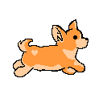

# Run-Corgi-Run
"Run Corgi Run!", is the name of my first student-designed game using the Unity game engine. I worked with my classmates Apple Sheng and Nate Carnahan. I worked primarily on sprite animation, sprite art, asset layering, concept design, and art. 

